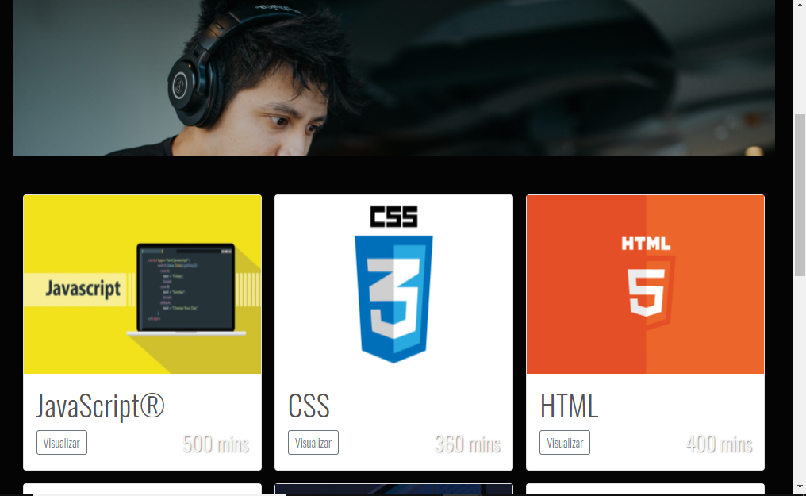
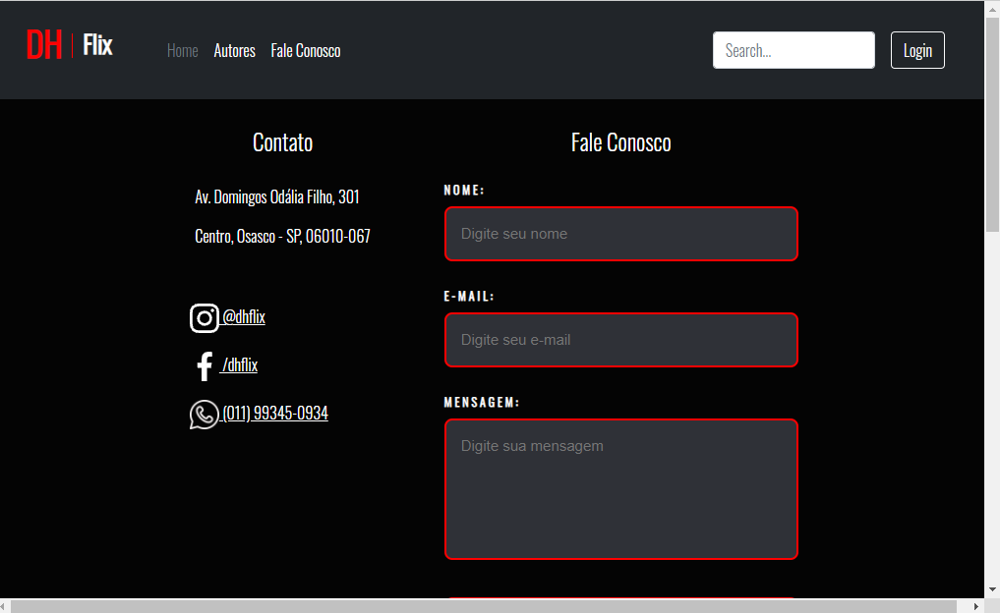

<h1 align="center">
     🎨<a href="#" alt="site DHFlix"> Projeto de Avaliação: Front End 1</a>
</h1>

<h3 align="center">
    💻 Trabalho final de avaliação para a matéria de Front End 1 do Curso CTD da Digital House. Criação de um site de streaming de cursos de conteúdo digital da Digital House.📺
</h3>


<h4 align="center">
	🚧 Concluído 🚀 🚧
</h4>

Tabela de conteúdos
=================
<!--ts-->
  * [🖥️ Sobre o projeto](#----sobre-o-projeto)
  * [⚙️ Funcionalidades](#---funcionalidades)
  * [🎨 Layout](#---layout)
    + [Home](#home)
    + [Visao dos cursos](#visao-dos-cursos)
    + [Fale Conosco](#fale-conosco)
  * [🚀 Como executar o projeto](#---como-executar-o-projeto)
    + [Pre-requisitos](#pre-requisitos)
      - [🧭 Rodando a aplicacao web (Frontend)](#---rodando-a-aplicacao-web--frontend-)
  * [🛠 Tecnologias](#---tecnologias)
  * [👨🏻‍💻👨🏼‍💻👨🏻‍💻👨🏻‍💻👩🏽‍💻 Autores](#------------------------------------autores)
<!--te-->


## 🖥️ Sobre o projeto

O objetivo deste site é servir como uma interface para um suposto serviço de streaming de vídeo aulas com os professores da Digital House.
Neste projeto o time aplicou os conhecimentos adquiridos na matéria ao longo do bimestre, como: transições e animações em css e as tags de HTML.

---

## ⚙️ Funcionalidades                                        

- [x] Representar uma pataforma de cursos EAD a partir de 10 páginas 
	- [x] Os alunos teriam acesso aos cursos a partir do seu login
	- [x]Entrar em contato com a escola a partir do campo "Fale Conosco"

- [x] Saber quem foram os alunos que produziram o projeto

---

## 🎨 Layout

### Home


### Visao dos cursos


### Fale Conosco


---

## 🚀 Como executar o projeto
Este projeto possui apenas uma parte:

1. Frontend 
### Pre-requisitos

Antes de começar, você vai precisar ter instalado em sua máquina a seguinte ferramenta:
[Git](https://git-scm.com). 


#### 🧭 Rodando a aplicacao web (Frontend)

```bash
# Download deste repositório
https://github.com/BeatrizMalengo/CHECKPOINTFINAL.git

# Acesse a pasta do repositório na sua máquina

#Execute o arquivo
index.html

# A partir da página inicial, é possível acessar todas as outras por meio dos links e botões

```

---

## 🛠 Tecnologias

As seguintes ferramentas foram usadas na construção do projeto:

-  **[HTML](https://developer.mozilla.org/pt-BR/docs/Web/HTML)**
-  **[CSS](https://developer.mozilla.org/pt-BR/docs/Web/CSS)**


---


## 👨🏻‍💻👨🏼‍💻👨🏻‍💻👨🏻‍💻👩🏽‍💻 Autores

<a href="https://media-exp1.licdn.com/dms/image/C5603AQFZopnLuEDgKw/profile-displayphoto-shrink_800_800/0/1624393305147?e=1639008000&v=beta&t=eLRqFPAaSCcXpIEYprq88gyNwwEX2HDJj80bhystlyg">
 
 <br />
 <sub><b>Alexander Bandeira</b></sub></a> 🦹🏼‍
 <br />

[](https://www.linkedin.com/in/alexander-bandeira-5134811b7/) 


<a href="img/andre.png">
 
 <br />
 <sub><b>André José da Silva</b></sub></a>🧙‍♂️
 <br />

[](https://www.linkedin.com/in/alexander-bandeira-5134811b7/) 


<a href="https://media-exp1.licdn.com/dms/image/C5603AQGprO4AnVD7jg/profile-displayphoto-shrink_800_800/0/1621455864395?e=1638403200&v=beta&t=lsweSDsnFyygCVziMEj70Mr7MAJ9zxEVwDKcqEjnTI8">
 
 <br />
	<sub><b>Beatriz Malengo</b></sub></a>🧝🏽‍♀️
 <br />

[](https://www.linkedin.com/in/beatriz-andrade/)


	 
<a href="img/bruno.jpg">

<br />
	<sub><b>Bruno Barros Miranda</b></sub></a>👨‍🦱
<br />

[](https://www.linkedin.com/in/bruno-b-miranda/) 


<a href="img/felipe.jpg">

<br />
	<sub><b>Felipe Seo</b></sub></a>🐸
<br />

[](https://www.linkedin.com/in/felipe-seo/)


---

Feito com ❤️ pelo grupo mais entrosado que você irá encontrar! 👋🏽 [Entre em contato!](https://discord.com/channels/@me/892201205663670272)
